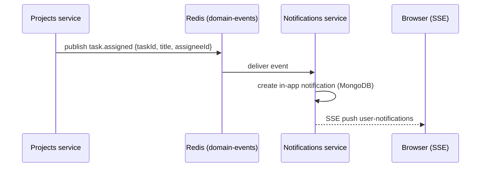

# NexusOne — System Architecture

## 1. Overview

NexusOne is a multi-tenant enterprise collaboration platform (SRS v2.0).
This MVP implements a **microservices backend** with nine NestJS services
behind one **API Gateway**, a **Next.js web client**, and three datastores
(PostgreSQL, MongoDB, Redis). Each SRS module maps to one owning service,
and every module is gated per-organization by an **Entitlements** model
(SRS §2.3) — the gateway/frontend reads these flags to enable/disable
navigation and APIs.

## 2. Target vs. MVP architecture

```mermaid
flowchart TB
    subgraph Clients
        Web["Web — Next.js (this repo)"]
    end

    Web -->|REST /api/*| Gateway["API Gateway (NestJS)"]
    Web -->|GraphQL /graphql| Gateway
    Web -->|WebSocket| ChatSvc

    Gateway --> AuthSvc["Auth Service (3001)"]
    Gateway --> OrgSvc["Org Service (3002)"]
    Gateway --> ChatSvc["Chat Service (3003)"]
    Gateway --> ProjSvc["Projects Service (3004)"]
    Gateway --> FileSvc["Files Service (3005)"]
    Gateway --> CalSvc["Calendar Service (3006)"]
    Gateway --> NotifSvc["Notifications Service (3007)"]
    Gateway --> AISvc["AI Copilot Service (3008)"]

    AuthSvc --> PG[(PostgreSQL)]
    OrgSvc --> PG
    ProjSvc --> PG
    FileSvc --> PG
    CalSvc --> PG

    ChatSvc --> Mongo[(MongoDB)]
    NotifSvc --> Mongo

    ChatSvc --> Redis[(Redis)]
    NotifSvc --> Redis
    AuthSvc -. publish .-> Redis
    ProjSvc -. publish .-> Redis
    CalSvc -. publish .-> Redis
    Redis -. domain-events .-> NotifSvc
    Redis -. org.created .-> ChatSvc
```

### SRS → service mapping

| SRS module      | Owning service      | Status                  |
| --------------- | ------------------- | ----------------------- |
| Auth & Identity | auth                | Built (JWT + RBAC)      |
| Organization    | org                 | Built                   |
| Chat            | chat                | Built (REST + WS)       |
| Projects/Tasks  | projects            | Built (kanban)          |
| Drive/Files     | files               | Built (local storage)   |
| Calendar        | calendar            | Built                   |
| Notifications   | notifications       | Built (SSE + event bus) |
| AI Copilot      | ai                  | Built (OpenAI + fallback) |
| Analytics/Admin | org (admin API) + gateway GraphQL | Built |
| Meetings        | —                   | Designed, not built     |
| HR / Ticketing / Workflow | —      | Designed, gated off in entitlements |

## 3. Cross-service communication

Services are **decoupled through an event bus** (Redis pub/sub in the MVP,
Kafka in production) — they never call each other synchronously:



Events: `org.created`, `task.assigned`, `chat.mentioned`, `event.reminder`,
`invite.accepted`. Consumers are idempotent; publishing is best-effort
(services never crash if the bus is down). **Production upgrade:** Kafka for
durable, replayable events + BullMQ for delayed jobs (e.g. calendar reminders).

## 4. Data stores

| Store      | Used for                                                    |
| ---------- | ----------------------------------------------------------- |
| PostgreSQL | Users, orgs, memberships, invites, departments, teams, entitlements, audit, workspaces, projects, tasks, sprints, files, folders, share links, events, refresh tokens |
| MongoDB    | Channels, messages, notifications (document-shaped, hot paths) |
| Redis      | Presence, domain-event fan-out, (production) rate limits and sessions |
| Disk (uploads/) | File objects via a `StorageProvider` interface (S3-ready) |

## 5. Security

- **JWT access tokens** (8h) + **rotating refresh tokens** (7d, revocable,
  persisted in PostgreSQL). Tokens carry `sub, email, name, orgId, roles`.
- **RBAC** enforced in every service by global `JwtAuthGuard` + `RolesGuard`
  (`SUPER_ADMIN > ORG_ADMIN > MANAGER > EMPLOYEE > GUEST`).
- **Tenant isolation**: every row carries `orgId`; the orgId always comes
  from the verified token, never from client input. Access checks also apply
  at channel level (private/dm channels require membership).
- **Validation**: class-validator DTOs with `whitelist: true` on every service.
- **Rate limiting** at the gateway (in-memory MVP, Redis in production).
- Upgrade path to ABAC + SSO/SAML is documented in `deployment.md`.

## 6. GraphQL vs REST (SRS §8)

REST is the canonical resource API (used by every module). GraphQL lives on
the gateway as the **client aggregation layer** — dashboards that combine
several services in one round trip (`dashboard`, `tasksByProject`,
`channels`, `notifications`, `createTask`, `summarizeChat`).

## 7. Production considerations (not in the MVP)

- Replace in-memory rate limiter with Redis-backed `@nestjs/throttler`.
- Replace local disk with S3 + virus scanning + chunked uploads.
- Kafka event backbone, Elasticsearch full-text search, SFU for meetings.
- Kubernetes + Terraform, Prometheus/Grafana/OpenTelemetry, blue/green deploys.
- Cookie-based token storage + CSRF protection (MVP uses Bearer headers).
