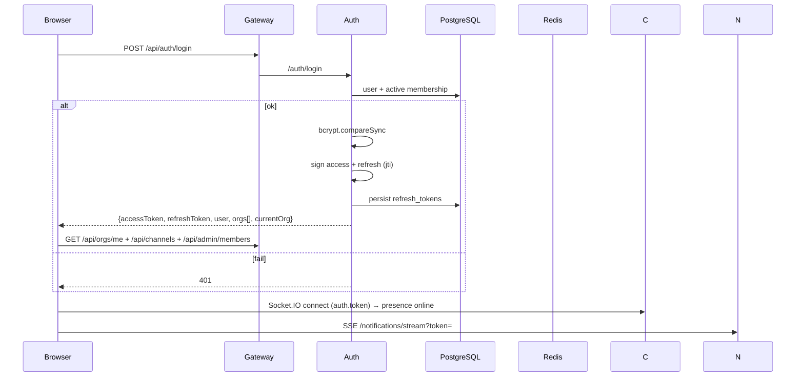

# NexusOne — Authentication & Authorization Flow

## 1. Token model

| Token | Claims | Lifetime | Storage |
| ----- | ------ | -------- | ------- |
| Access | `sub, email, name, orgId, orgName, orgSlug, roles[], type:'access'` | 8h (configurable) | client (zustand persist) |
| Refresh | `sub, jti, orgId, type:'refresh'` | 7d | PostgreSQL `refresh_tokens` (jti) |

Every service verifies the access token with the shared `JWT_SECRET`
(`JwtAuthGuard`). The `orgId` in the token is the only source of tenant
identity — no client-supplied org id is trusted.

## 2. Login flow

## 3. Refresh & rotation

- `POST /api/auth/refresh` verifies the refresh JWT, checks `refresh_tokens`
  for `jti` (revoked/expired → 401), then **revokes the old token** and
  issues a fresh pair (rotation prevents token replay).
- `POST /api/auth/logout` revokes every refresh token of the user (remote
  sign-out across devices).
- Production upgrade: Redis denylist for access tokens + session listing per
  user (SRS §4.1 device recognition).

## 4. Multi-organization switching

`/auth/switch-org` verifies the access token, looks up an **active
membership** for the target org, and re-issues tokens with the new
`orgId + roles`. The frontend org switcher calls this and reloads shell data.

## 5. RBAC

| Role | Scope | Granted by |
| ---- | ----- | ---------- |
| SUPER_ADMIN | platform-wide | seed / DB |
| ORG_ADMIN | tenant-wide admin | org creator, admin action |
| MANAGER | department/team admin | admin action |
| EMPLOYEE | self + assigned work | invite default / admin |
| GUEST | explicitly shared items only | invite |

Enforcement: `JwtAuthGuard` (all routes by default, `@Public()` to opt out)
→ `RolesGuard` (`@Roles(...)`) → channel-level membership checks in chat.
Admin role changes and entitlements toggles are recorded in `audit_logs`.

## 6. Invitation flow

1. Admin/Manager `POST /api/auth/invites {email, role}` → token (7d expiry).
2. Invitee opens `/invite?token=...` (or the accept endpoint directly).
3. `POST /api/auth/invite/accept {token, name, password}`:
   - validates token + expiry,
   - creates the user if new (email = invite email),
   - creates membership with the invited role,
   - publishes `invite.accepted` → the inviter gets a notification.
