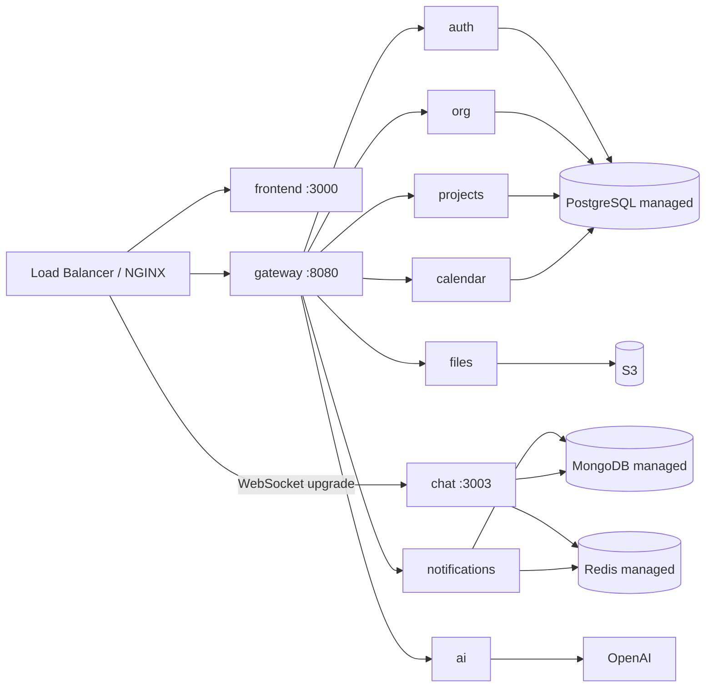

# NexusOne — Deployment Guide

## 1. Deploy to Render (recommended — free, ~15 minutes)

`render.yaml` at the repo root is a complete Render **Blueprint**: it provisions
PostgreSQL, Redis, MongoDB (container), all 9 backend services and the web app,
and wires the environment variables between them. No cloud CLI, no Docker
required on your machine — Render builds everything in the cloud.

### Step 1 — Push the repo to GitHub

```bash
cd nexusone
git init && git add -A && git commit -m "NexusOne initial commit"
git branch -M main
git remote add origin https://github.com/<you>/nexusone.git
git push -u origin main
```

### Step 2 — Create the blueprint

1. Sign up at [render.com](https://render.com) (free account is enough).
2. Click **New → Blueprint** (dashboard top-right).
3. Select the `nexusone` GitHub repo and click **Connect**.
4. Render parses `render.yaml` and shows ~12 resources: 2 datastores,
   `nexusone-mongo`, 9 backend services, `nexusone-web`. Review and click
   **Apply**.

The first deploy takes 10–15 minutes (each service builds the same shared
Docker image with a different `SERVICE` env var). Subsequent deploys are fast.

### Step 3 — Post-deploy (2 minutes)

- **Optional — real AI:** open `nexusone-ai` → *Environment* and add
  `OPENAI_API_KEY`. Without it the Copilot uses the built-in deterministic
  fallback engine (still fully functional).
- **Verify:** open `https://nexusone-web.onrender.com` and log in with
  `alice.admin@nexuslabs.io / Admin@123`.
- **Swagger / GraphQL:** `https://nexusone-gateway.onrender.com/docs` and
  `https://nexusone-gateway.onrender.com/graphql`.

### Notes & gotchas

- **Subdomains are first-come, first-served.** If any `nexusone-*` name is
  taken, Render asks you to rename it — then update the hardcoded URLs in
  `render.yaml` (`SERVICE_*_URL`, `CLIENT_ORIGIN`, `NEXT_PUBLIC_*`,
  `wss://nexusone-chat.onrender.com`) to the real URLs and re-sync.
- **Free tier sleeps** services after ~15 min idle; the first request after
  idle cold-starts in under a minute. Click around the app to wake services.
- **Files** are stored on a 1 GB persistent disk attached to `nexusone-files`
  (local disk provider). Swap to S3 before heavy production use.
- **MongoDB** runs as a container without auth, reachable only on Render's
  private network. For production, use MongoDB Atlas and set `MONGO_URI` on
  `nexusone-chat` and `nexusone-notifications`.
- Backend services are public HTTPS endpoints, protected by JWT verification
  (shared `JWT_SECRET`). For strict isolation later, move the gateway's
  `SERVICE_*_URL` to Render private networking (`property: host` + an internal
  port) — the gateway accepts any `http(s)://host[:port]` target.

## 2. Production topology



Run multiple replicas of every service behind the load balancer — all
services are stateless (sessions/presence/events live in Redis; files in
object storage). Scale chat replicas for WebSocket fan-out (Redis pub/sub
works across replicas; for very large orgs move to a dedicated fan-out
service per SRS §6.1).

## 3. Build & push images (self-hosted / Kubernetes)

The shared `backend/Dockerfile` builds **all** services in one image; the
`SERVICE` environment variable (default `gateway`) picks which one starts.

```bash
cd nexusone
docker build -f backend/Dockerfile -t registry.example.com/nexusone/backend:1.0.0 backend
docker push registry.example.com/nexusone/backend:1.0.0

docker build -f frontend/Dockerfile \
  --build-arg NEXT_PUBLIC_API_URL=https://api.example.com \
  --build-arg NEXT_PUBLIC_CHAT_WS_URL=wss://chat.example.com \
  -t registry.example.com/nexusone/web:1.0.0 frontend
docker push registry.example.com/nexusone/web:1.0.0
```

Run the backend image per service with `-e SERVICE=auth` (etc.). CI builds
images on every push (`.github/workflows/ci.yml`); wire the `docker` job to
push to GHCR and deploy with `docker compose` or Kubernetes.

## 4. Environment for production

- `JWT_SECRET`: strong random (e.g. `openssl rand -base64 48`). Must be the
  **same across all services**. Rotate carefully — invalidates all sessions.
- `NODE_ENV=production`: disables TypeORM `synchronize`. **Migrations:** the
  MVP relies on `database/postgres/schema.sql` + `synchronize` in dev. Before
  production, switch to TypeORM migrations or `node-pg-migrate` generated
  from the schema file.
- Set `CLIENT_ORIGIN` to your web origin; keep CORS locked down.
- `INTERNAL_SECRET` for any future service-to-service calls.
- Frontend builds bake in `NEXT_PUBLIC_*` (client bundle) — rebuild on change;
  the server-side rewrites in `next.config.mjs` read them at boot.

## 5. Managed databases / backups (SRS §14.2)

- PostgreSQL: managed instance with automated snapshots (RPO ≤ 15 min),
  point-in-time recovery, read replica for analytics.
- MongoDB: managed Atlas cluster with backups enabled.
- Redis: managed cache with persistence (AOF) since the refresh-token denylist
  and presence data live there in production.
- Files: S3 with versioning + lifecycle rules; **the MVP storage provider is
  local disk — swap `LocalStorageProvider` for the S3 implementation** (same
  `StorageProvider` interface) before production.

## 6. TLS, proxy and headers

Terminate TLS at NGINX / the load balancer (Render/Railway do this for you).
The gateway already sends helmet security headers and per-IP rate limits
(raise `RATE_LIMIT_MAX` and use the Redis-backed limiter once you have many
clients).

## 7. CI/CD (GitHub Actions)

`.github/workflows/ci.yml` runs on push/PR to `main`:

1. `backend` job — `npm ci`, typecheck all services, run unit tests, build.
2. `frontend` job — `npm ci`, `tsc --noEmit`, `next build`.
3. `docker` job — builds two images with buildx and **pushes them to GHCR on
   merge to main**:

   | Image | Contents |
   | ----- | -------- |
   | `ghcr.io/<owner>/nexusone/backend` | all 9 NestJS services (one shared image; `SERVICE` env selects the app) |
   | `ghcr.io/<owner>/nexusone/web` | Next.js frontend (standalone server) |

   Tags: `main` (rolling), `latest`, and `sha-<short>` per commit. Builds use
   the GitHub Actions layer cache, so rebuilds are fast. On PRs the images
   are built but not pushed (validation only).

4. `deploy` job (merge to main only) — fires the Render **deploy hook** after
   the images are pushed.

### How deployments happen on merge to main

- **Render Blueprint (default):** Render auto-deploys every service on each
  commit to the linked branch — no extra setup. Nothing else is needed.
- **Deploy hook (optional):** to also trigger services that don't watch the
  repo (auto-deploy off, or a service that pulls the fresh GHCR image), add a
  repository secret `RENDER_DEPLOY_HOOK_URL` (Render → service → *Deploy
  Hook* → copy URL). The `deploy` job then POSTs to it after images push. If
  the secret is absent the job is skipped. Any HTTP webhook works here.
- **GHCR + Docker hosts:** if a host pulls from GHCR (Render `runtime:
  image`, a VPS, Kubernetes), give it registry access (Render: *Registry
  Credential* with a GHCR PAT; k8s: `imagePullSecrets`) and pin the image
  tag (`main` or `sha-<short>`).
- **Web image build args:** `NEXT_PUBLIC_API_URL` and
  `NEXT_PUBLIC_CHAT_WS_URL` are inlined at build time. CI defaults them to
  the Render URLs; override with repository **variables** of the same name
  (Settings → Secrets and variables → Actions).

## 8. Operational runbook (short version)

- **Rollout**: blue/green or canary per service (independent deploys are the
  point of the microservice split).
- **Monitoring**: add Prometheus metrics via `@nestjs/terminus` +
  OpenTelemetry exporters; Grafana dashboards for request latency, chat
  fan-out, queue lag.
- **Scaling order**: chat (WS replicas) → notifications → gateway → PG read
  replica → shard Mongo by org.
- **Security tests**: RBAC boundary tests per role, pen test before SOC 2
  audit (SRS §13).
