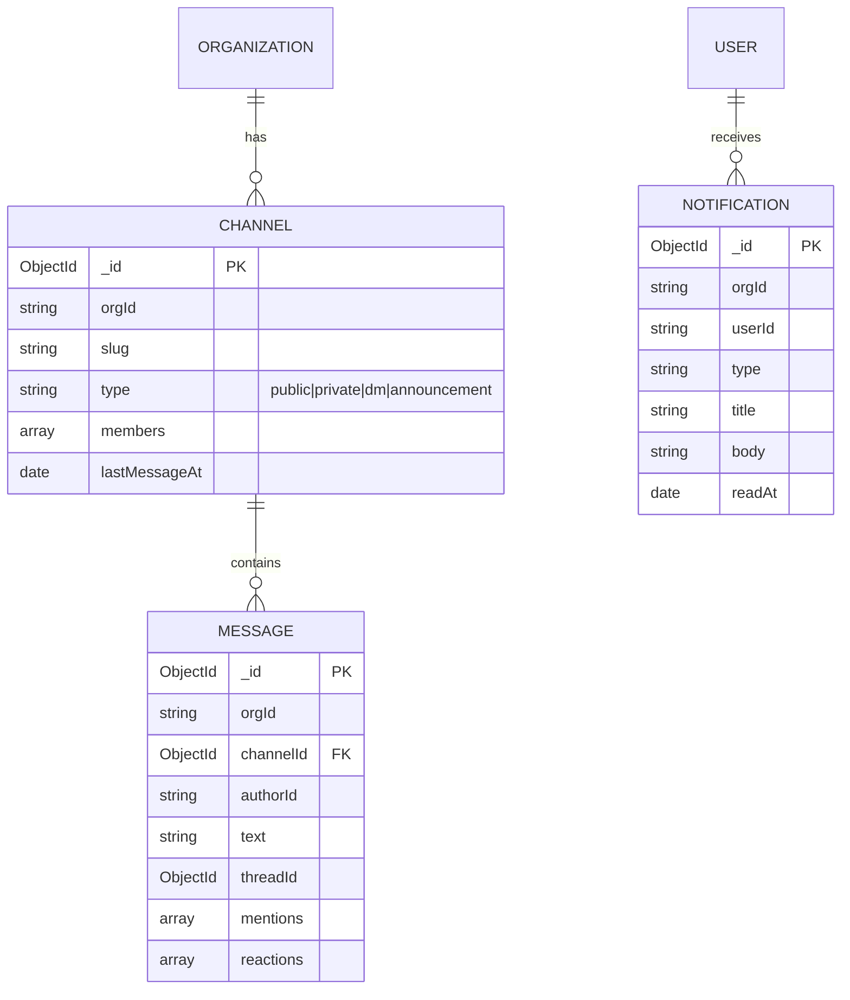

# NexusOne — Data Model (ER diagrams)

Canonical DDL lives in `database/postgres/schema.sql`; MongoDB collections
are defined in each service's Mongoose schemas (`database/mongo/collections.md`).

## 1. PostgreSQL — relational entities

```mermaid
erDiagram
    USERS ||--o{ MEMBERSHIPS : has
    ORGANIZATIONS ||--o{ MEMBERSHIPS : contains
    USERS ||--o{ REFRESH_TOKENS : issues
    ORGANIZATIONS ||--o{ INVITATIONS : invites
    ORGANIZATIONS ||--o{ DEPARTMENTS : organizes
    DEPARTMENTS ||--o{ TEAMS : groups
    TEAMS ||--o{ TEAM_MEMBERS : has
    USERS ||--o{ TEAM_MEMBERS : joins
    ORGANIZATIONS ||--o{ ENTITLEMENTS : licenses
    ORGANIZATIONS ||--o{ AUDIT_LOGS : logs
    ORGANIZATIONS ||--o{ WORKSPACES : owns
    WORKSPACES ||--o{ PROJECTS : contains
    PROJECTS ||--o{ TASKS : tracks
    TASKS ||--o{ TASKS : parents
    TASKS ||--o{ TASK_COMMENTS : has
    PROJECTS ||--o{ SPRINTS : plans
    ORGANIZATIONS ||--o{ FOLDERS : stores
    FOLDERS ||--o{ FOLDERS : nests
    FOLDERS ||--o{ FILES : contains
    FILES ||--o{ SHARE_LINKS : shares
    ORGANIZATIONS ||--o{ CALENDAR_EVENTS : schedules

    USERS {
        uuid id PK
        text email UK
        text password_hash
        text name
        text avatar_url
        boolean is_active
    }
    ORGANIZATIONS {
        uuid id PK
        text slug UK
        text name
        text plan
        jsonb settings
    }
    MEMBERSHIPS {
        uuid id PK
        uuid user_id FK
        uuid org_id FK
        jsonb roles
        text status
    }
    REFRESH_TOKENS {
        uuid id PK
        uuid user_id FK
        text jti UK
        timestamptz expires_at
        timestamptz revoked_at
    }
    INVITATIONS {
        uuid id PK
        uuid org_id FK
        text email
        text role
        text token UK
        timestamptz expires_at
    }
    DEPARTMENTS { uuid id PK, uuid org_id FK, text name }
    TEAMS { uuid id PK, uuid org_id FK, uuid department_id FK, text name }
    ENTITLEMENTS { uuid id PK, uuid org_id FK, text module, boolean enabled }
    AUDIT_LOGS { uuid id PK, uuid org_id FK, text action, jsonb metadata }
    WORKSPACES { uuid id PK, uuid org_id FK, text name }
    PROJECTS { uuid id PK, uuid org_id FK, text key, text name, text status }
    TASKS {
        uuid id PK
        uuid org_id FK
        uuid project_id FK
        uuid parent_id FK
        text title
        text status
        text priority
        uuid assignee_id
        uuid reporter_id
        date due_date
        jsonb labels
        int order_index
    }
    TASK_COMMENTS { uuid id PK, uuid task_id FK, text body }
    SPRINTS { uuid id PK, uuid project_id FK, text name, date start_date, date end_date }
    FOLDERS { uuid id PK, uuid org_id FK, uuid parent_id FK, text name }
    FILES { uuid id PK, uuid org_id FK, uuid folder_id FK, text name, bigint size, text storage_key, int version }
    SHARE_LINKS { uuid id PK, uuid file_id FK, text token UK, text permission, timestamptz expires_at }
    CALENDAR_EVENTS { uuid id PK, uuid org_id FK, text title, timestamptz start_at, timestamptz end_at, jsonb attendees }
```

## 2. MongoDB — document collections



## 3. Redis — keys

| Key pattern | Purpose | TTL |
| ----------- | ------- | --- |
| `presence:{orgId}:{userId}` | JSON presence entry | 5 min |
| `presence:org:{orgId}` | set of online user ids | 5 min (refreshed) |
| (prod) `rate:{ip}` | rate-limit window | 60 s |
| (prod) `refresh:{jti}` | refresh-token denylist | 7 d |

## 4. Storage (files)

`uploads/{orgId}/{uuid}-{name}` — canonical object key is stored in the
`files.storage_key` column; `StorageProvider` abstracts the backend so S3 is
a drop-in swap.
