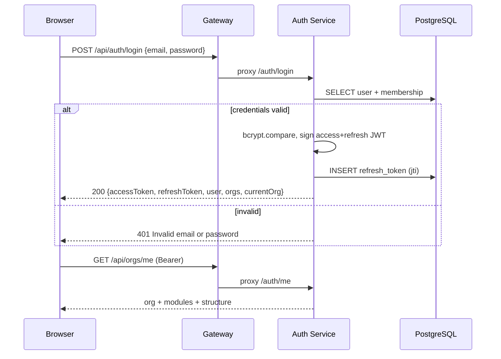
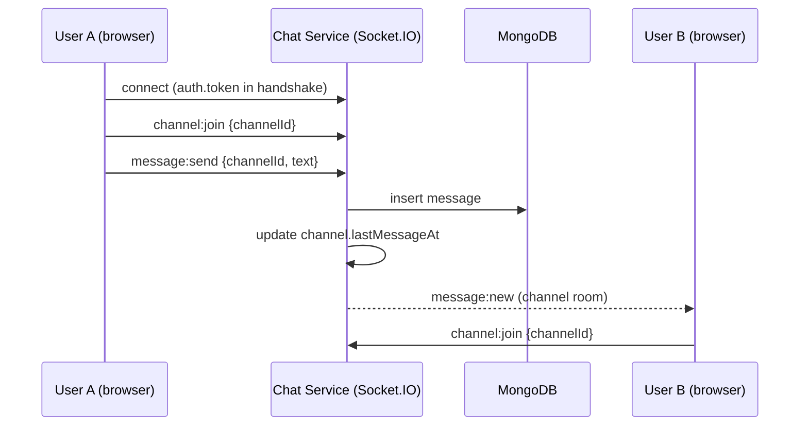
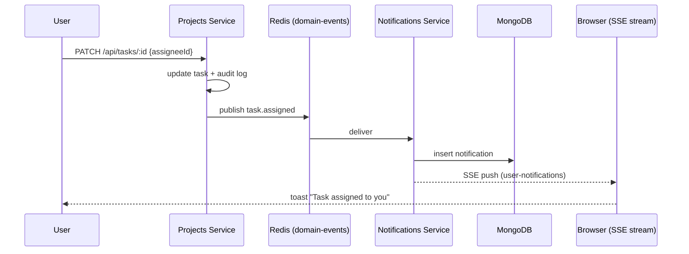
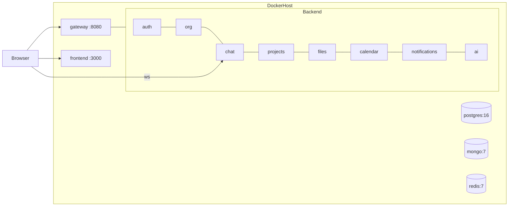

# NexusOne — UML Diagrams

## 1. Domain class diagram (core services)

```mermaid
classDiagram
    class AuthService {
        +register(dto) Session
        +login(dto) Session
        +refresh(dto) Session
        +logout(userId) void
        +switchOrg(userId, orgId) Session
        +createInvite(dto, actor) Invitation
        +acceptInvite(dto) Session
    }
    class UsersService {
        +findByEmail(email) User
        +findWithPassword(email) User
        +create(data) User
    }
    class JwtAuthGuard {
        +canActivate(ctx) boolean
    }
    class RolesGuard {
        +canActivate(ctx) boolean
    }
    class AuthService --> UsersService
    AuthService ..> JwtAuthGuard : protected by
    AuthService ..> RolesGuard : protected by

    class ChatService {
        +listChannels(orgId, userId) Channel[]
        +createChannel(dto, user) Channel
        +sendMessage(channelId, dto, user) Message
        +toggleReaction(messageId, emoji, user) Message
        +search(orgId, q) Message[]
        +canAccess(channel, orgId, userId) boolean
    }
    class ChatGateway {
        +handleConnection(socket) void
        +onMessage(socket, payload) void
        +onReaction(socket, payload) void
    }
    class PresenceService {
        +setStatus(orgId, userId, status) void
        +onlineUserIds(orgId) string[]
    }
    ChatGateway --> ChatService
    ChatGateway --> PresenceService

    class ProjectsService {
        +createProject(dto, user) Project
        +createTask(dto, user) Task
        +updateTask(orgId, taskId, dto, user) Task
        +board(orgId, projectId) Board
        +addComment(orgId, taskId, body, user) TaskComment
        -notifyAssignment(task, actor) void
    }
    class DomainEventsService {
        +publish(type, orgId, payload) void
    }
    ProjectsService --> DomainEventsService

    class NotificationsService {
        +create(orgId, userId, input) Notification
        +list(userId, orgId, limit) Notification[]
        +stream(userId, orgId) Observable
    }
    class EventsConsumer {
        +handle(event) void
    }
    EventsConsumer --> NotificationsService

    class CopilotService {
        +summarize(dto) CopilotResult
        +generateTasks(dto) CopilotResult
        +draft(dto) CopilotResult
        +ask(dto) CopilotResult
        -fallbackSummarize(dto) CopilotResult
    }
```

## 2. Sequence — authentication flow



## 3. Sequence — realtime message delivery



## 4. Sequence — task assignment → notification



## 5. Deployment diagram


